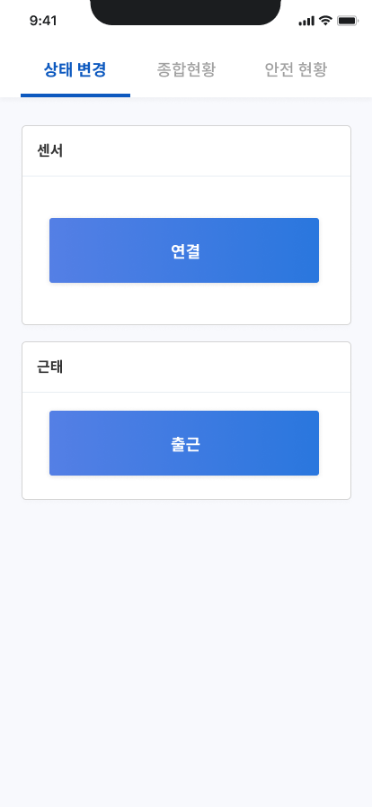
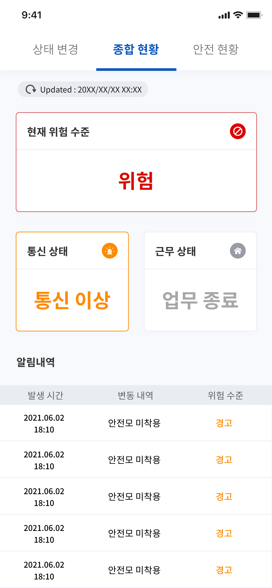
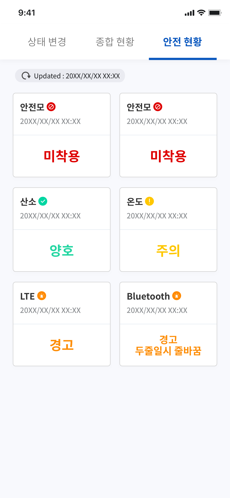
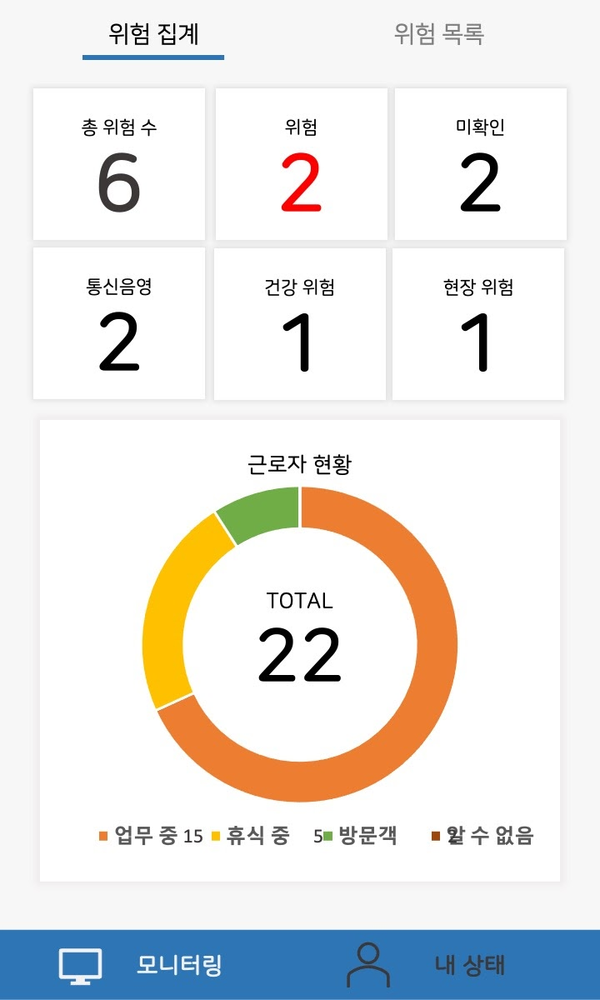
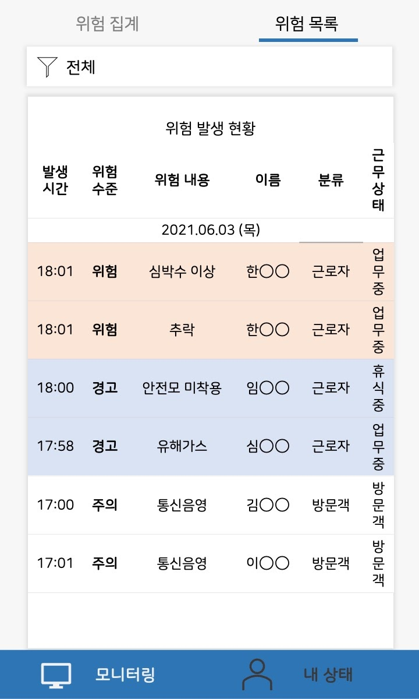

# Tutum Safety Management App
> 투툼 안전관리 앱은 개별 근로자의 이상상태를 관리하고 투툼 안전모 센서 모듈과 투툼 서버 간의 데이터 통신을 지원한다.

---
# 🛠 Tech Stack - 기술 스택

## 💻 Flutter

> iOS/Android 모두 개발할 수 있는 크로스플랫폼.

## GetX

상태관리 및 라우팅 기능 지원 패키지

## flutter_bluetooth_serial, flutter_blue

Bluetooth Classic, BLE 통신 지원 패키지

---

# 🕹 Function - 기능

## 데이터 중계

 블루투스로 안전모 센서 모듈에서 센서 데이터를 수신 받고 가공하여 서버로 전송함

## 이상상태 탐지

 센서 데이터를 통해서 이상상태 기준에 따라 이상상태를 판별하고 판별 결과를 서버로 전송함

## 비콘 탐지

 비콘의 RSSI 값을 수집하여 Theil-Sen 알고리즘을 적용하고 결과에 따라 비콘 지나감 여부를 판별함.

---
# 📜 View - 화면

## 상태 변경 (개발 전)

 근로자의 안전모 센서 모듈 연결, 근태 변경 등 상태 변경

## 개별 이상상태 현황 모니터링 (개발 전)

 실시간 종합 이상상태 현황을 표시하는 모니터링 화면

## 원격 대시보드 접속 (개발 전)

 관리자에 대해 투툼 모니터링 시스템의 대시보드에 원격으로 접속할 수 있도록 지원

## 이상상태 알림 (개발 전)

 해당 근로자에게 이상상태 발생 시 Push 알림으로 이상상태 정보 제공. 관리자의 경우, 이상상태에 해당하는 근로자 정보까지 표시

 
 
 
---

# ☎️  Manager - 담당자

**👩🏻‍💻**  김예슬

📧  imys0613@naver.com