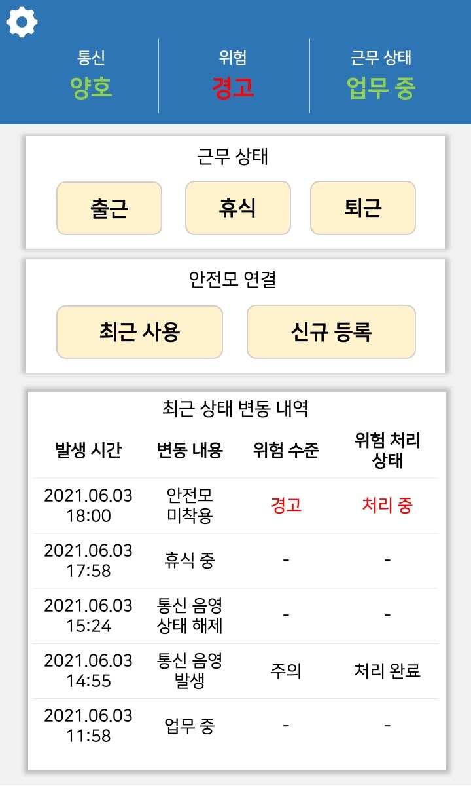

# Tutum Safety Management App
> 투툼 안전관리 앱은 개별 근로자의 이상상태를 관리하고 투툼 안전모 센서 모듈과 투툼 서버 간의 데이터 통신을 지원한다.

---
# 🛠 Tech Stack - 기술 스택

## 💻 Flutter

> iOS/Android 모두 개발할 수 있는 크로스플랫폼.

---
# 📜 View - 화면

## 내 상태 

 실시간 이상상태 현황 및 근태관리/투툼 안전모 센서모듈 연결 기능 등을 제공하는 모니터링 화면

## 원격 대시보드 접속

 관리자에 대해 투툼 모니터링 시스템의 대시보드에 원격으로 접속할 수 있도록 지원

 
## 이상상태 알림

 해당 근로자에게 이상상태 발생 시 Push 알림으로 이상상태 정보 제공. 관리자의 경우, 이상상태에 해당하는 근로자 정보까지 표시

 
 
 
---
# ☎️  Manager - 담당자

**👩🏻‍💻**  김예슬

📧  imys0613@naver.com